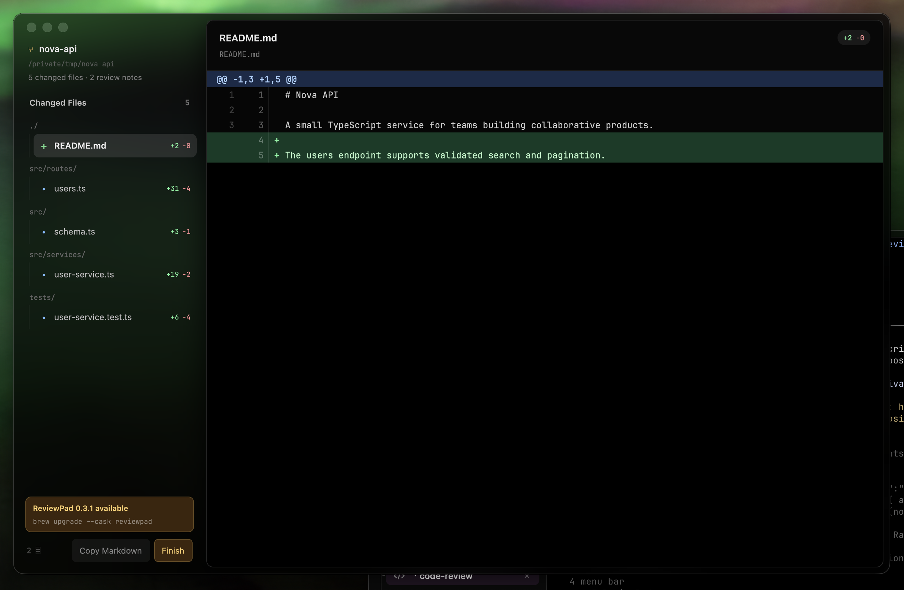

# ReviewPad

[](https://github.com/shkumbinhasani/reviewpad/actions/workflows/ci.yml)
[](https://github.com/shkumbinhasani/reviewpad/releases/latest)
[](LICENSE)

ReviewPad is a local-first Git review tool with one Rust binary and two interfaces:

- a GPU-rendered desktop review panel built with [GPUI](https://www.gpui.rs/), the UI framework created for Zed;
- an agent-friendly CLI that can block while a human reviews, then return the completed review as Markdown on stdout.



It reviews code, and it reviews renders: a video can be played and commented on
at a given moment, an image at a given place, and both come back out as
something an agent can act on.

It reads staged, unstaged, and untracked changes. Comments are anchored to old or new line numbers and stored in `.reviewpad/comments.json` at the repository root, where an agent can read them directly. That directory ignores itself, so review state never dirties the working tree it is inspecting. A review still living under the old `.git/reviewpad/` path is migrated forward the first time it is opened.

## Install

```sh
brew install --cask shkumbinhasani/tap/reviewpad
```

That puts `ReviewPad.app` in `/Applications` and `reviewpad` on your `PATH`. The
build is a universal binary, ad-hoc signed and unnotarized, so the cask strips
the quarantine flag on your behalf.

You can also grab `ReviewPad-macos-universal.zip` or the bare
`reviewpad-macos-universal.tar.gz` from the
[latest release](https://github.com/shkumbinhasani/reviewpad/releases/latest);
`SHA256SUMS` is published alongside them.

### Betas

A tag with a pre-release suffix — `v0.9.0-rc.1` — publishes to a separate
channel, so a build can be tried on a real machine without going anywhere near
what `brew install --cask reviewpad` hands out:

```sh
brew install --cask shkumbinhasani/tap/reviewpad@beta
brew install --cask shkumbinhasani/tap/reviewpad       # go back to stable
```

The two casks own the same `ReviewPad.app`, so Homebrew keeps them mutually
exclusive rather than letting one quietly overwrite the other — installing one
tells you to uninstall the other first. A pre-release is left off
`releases/latest`, so `reviewpad update` never offers a beta to somebody who did
not ask for one; when the final ships, it does supersede the beta you are on.

To test a change with no release at all: `./scripts/bundle-macos.sh` builds
`dist/ReviewPad.app` locally, and CI attaches a `ReviewPad-app` artifact to every
push and pull request.

### Updates

ReviewPad checks for a newer release when it opens and shows an unobtrusive
notice in the sidebar — the check is advisory and never blocks a review.

```sh
reviewpad update --check   # report what is available
reviewpad update           # download, verify and install it
```

`reviewpad update` verifies the download against the SHA-256 in the release
manifest and swaps the binary in atomically. Homebrew installs are left alone
on purpose — rewriting a file Homebrew tracks would desynchronize its manifest,
so those are pointed at `brew upgrade --cask reviewpad` instead.

## Build from source

GPUI currently supports macOS and Linux. On macOS, install Xcode and its optional Metal Toolchain, then run:

```sh
xcodebuild -downloadComponent metalToolchain
cargo build --release
cargo install --path .
```

To create a Finder-launchable macOS bundle (which opens a native repository picker):

```sh
./scripts/bundle-macos.sh          # host architecture
UNIVERSAL=1 ./scripts/bundle-macos.sh   # arm64 + x86_64, as released
open dist/ReviewPad.app
```

## Use it as a desktop app

From any directory inside a Git working tree:

```sh
reviewpad
```

Or point it at another working tree:

```sh
reviewpad open ../my-project
```

`reviewpad pick` opens the same native directory picker used by the `.app` bundle.

### Reviewing a branch

By default ReviewPad shows uncommitted work. To review what a branch added
instead — after an agent has committed and pushed, say — name the base it left:

```sh
reviewpad open --base main
```

That is `main...HEAD`: everything this branch changed since it diverged, and
nothing `main` did in the meantime. Any revision works, and a value containing
`..` is passed to git as a range verbatim:

```sh
reviewpad open --base origin/main
reviewpad open --base v0.5.0...HEAD
```

The base is recorded in the review file and printed in the exported Markdown,
because a line number only means something against a particular diff. Pass the
same `--base` to `reviewpad comment` so an agent's notes land on the lines it
meant.

Select a changed file, click a code line, type a comment, and press `Cmd+Enter` (or click **Add comment**). The sidebar marks which files carry notes and how many — gold while they are still drafts of yours, grey once they have been sent — so a glance down the column says what is left to do. **Copy Markdown** puts the complete implementation brief on the clipboard. **Finish** saves and closes the panel — when an agent is waiting, that button becomes **Send 3** and the panel stays open for the reply, reading **Waiting…** once the round is away.

## Use it from an AI agent

An agent should invoke:

```sh
reviewpad request /absolute/path/to/repository
```

Add `--base main` to review a branch rather than uncommitted changes.

The process opens the review panel and waits. When the user clicks **Finish review**, the process writes only the Markdown review to stdout and exits. The agent can then implement each item.

For a review that goes back and forth rather than ending there, add `--submit-to <dir>`: each time the user presses **Send**, that round of notes is written into the directory as a Markdown file and the window stays open, so the agent can reply into the threads it came from and the user reads those replies as they arrive. This is what the MCP server does, and it is the better shape — see below.

Noninteractive commands are also available:

```sh
reviewpad export .   # print the current review as Markdown
reviewpad list .     # list comments with their ids
reviewpad clear .    # remove all saved comments
```

### Notes are Markdown

An agent answers in Markdown whether or not it was asked to, so the panel reads
it as Markdown: backticked identifiers, `**emphasis**`, bullet and numbered
lists, block quotes, and fenced code blocks drawn as monospaced blocks with
their language named. Anything it does not recognize is left as the characters
that were typed, so nothing you write can disappear into punctuation. Underscores
are deliberately not emphasis — `snake_case` names survive intact.

### Reviewing renders

A changed video or image opens as itself rather than as a patch. Video plays
through AVFoundation — hardware decode, audio, real seeking — and clicking the
picture drops a pin.

Render output is usually gitignored, so a rendered file has to be named:

```sh
reviewpad open . --include out/promo.mp4
```

Anything already carrying a comment is included automatically, so a render
commented on from the CLI is reachable in the panel afterwards.

Comments anchor to what the file is:

```sh
# A moment in a video. The frame is recorded alongside the time, because a
# composition is written in frames.
reviewpad comment out/promo.mp4 --time 12.5 --body "The slide should ease out."

# A moment and a place in that frame.
reviewpad comment out/promo.mp4 --time 4.0 --spot 0.8,0.5 --body "Exits early."

# A place on an image. Percentages work too.
reviewpad comment design/hero.png --spot 50%,20% --body "Too much headroom."
```

which an agent reads back as:

```
## 1. `out/promo.mp4` — 0:12.500 · frame 375 — c1

The slide should ease out.
```

Spots are normalized to 0..1, so they stay correct whatever size the media is
displayed at.

### Writing comments and replying

An agent can leave notes of its own and answer the ones it was given. Every
comment gets a short id, and replying to one continues its thread:

```sh
# Anchor a note to a changed line. Prints the new id on stdout.
id=$(reviewpad comment src/lib.rs 11 --body "This allocates on every call." --author claude)

# Reply into that thread. --author signs it; ids nest as c1.1, c1.2, ...
reviewpad reply "$id" --body "Fixed by borrowing instead." --author claude

# Long bodies can come from stdin instead of an argument.
git log -1 --format=%B | reviewpad reply c1.1 --author claude

reviewpad remove c1.2   # drop a single reply, or c1 for the whole thread
```

Each author gets an avatar: known agents show their own mark in their brand
color, anyone else gets a colored monogram from their name, and the local user's
Gravatar is used when their Git email has one. Set `REVIEWPAD_NO_GRAVATAR` to
skip that lookup — it is the only request ReviewPad makes that derives from your
identity.

`--side old` anchors to the line as it was before the change; the default is
`new`. `--repo` points at another working tree, and `reviewpad list --json`
prints the review file itself for a machine to parse.

Replying accepts any id in a thread, so an agent can answer the message it just
read without walking back to the root — `reply c1.2` and `reply c1` both append
to thread `c1`.

## Use it as an MCP server

The same operations are available over the Model Context Protocol, so a client
gets them as typed tools rather than shell invocations:

```sh
claude mcp add reviewpad -- reviewpad mcp
```

`reviewpad mcp [path]` speaks JSON-RPC over stdio and never daemonizes. Eleven
tools: `open_review`, `request_review`, `refresh_review`, `close_review`,
`list_files`, `list_comments`, `export_review`, `add_comment`, `reply`,
`remove_comment`, `clear_review`.

The point of it is `request_review`: an agent finishes a change, asks a person to
look at it, and gets their notes back as a brief it can implement. That call
blocks for as long as the review takes, which is what makes it useful — nobody
has to tell the agent when the review is over. The server sends progress
notifications so the client does not give up waiting. `open_review` is there for
clients that cannot block, at the cost of having to poll.

The review is a conversation, not a handover. Notes are drafts until you press
**Send**; sending hands that round over and leaves the panel open. The agent
replies in each thread as it works, and those replies appear in the panel within
a second, so you watch the work rather than waiting for a summary — then answer
with another round. It ends when you close the window or the agent calls
`close_review`.

One window does the whole exchange. It re-reads the working tree every couple of
seconds, so the diff keeps up with what the agent is changing without anybody
reopening anything, and an agent that has just finished a change calls
`refresh_review` rather than asking for a second review.

**[Setup for Codex, opencode, Cursor, VS Code, Zed, Gemini CLI and Claude
Desktop →](docs/mcp.md)**

## Data and scope

- Diffs come from the current working tree relative to `HEAD`, plus untracked files — or from a branch range when `--base` names one.
- Untracked files are read directly rather than diffed one subprocess at a time; binary and oversized ones are listed without a patch.
- Video is decoded by AVFoundation into buffers GPUI binds as textures, so nothing is written to disk to play a clip.
- Review state is repository-local and survives closing the app.
- Comments and replies share one file, so the app and the CLI see each other's notes.
- ReviewPad never stages, resets, commits, or modifies project files.
- The MCP server is local and talks to nothing but the client that started it; opening the panel means launching this same binary.
- The Markdown includes the repository path, exact file/line/side anchors, comment text, and nearby diff context.

## Development

```sh
cargo fmt --all --check
cargo clippy --all-targets -- -D warnings
cargo test --all-targets
```

CI runs all three on every push and pull request, and separately proves the
`.app` bundle still builds.

## Releasing

The tag is the source of truth for the version, and the release job refuses to
publish if `Cargo.toml` disagrees with it.

```sh
# bump `version` in Cargo.toml first, then:
git tag v0.2.0 && git push origin v0.2.0
```

That builds a universal binary, bundles and ad-hoc signs `ReviewPad.app`,
publishes the archives with `SHA256SUMS` and the `latest.json` update manifest,
and pushes the new version to the Homebrew cask.

The cask step authenticates with `TAP_DEPLOY_KEY`, the private half of a write
deploy key on `shkumbinhasani/homebrew-tap`. The built-in `GITHUB_TOKEN` is
scoped to this repository and cannot push to another one; a deploy key is
narrower than a personal token, since it reaches exactly one repository and can
be revoked on its own.
